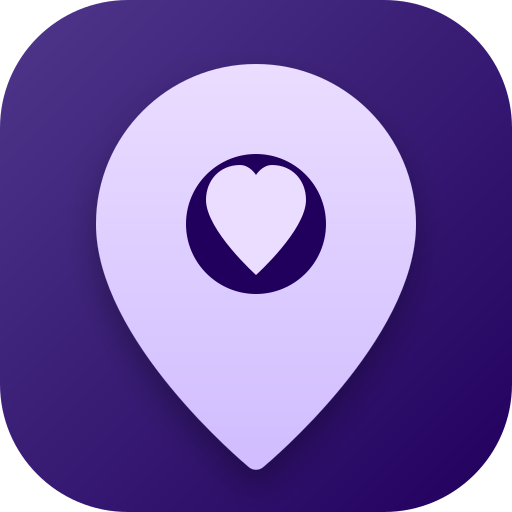
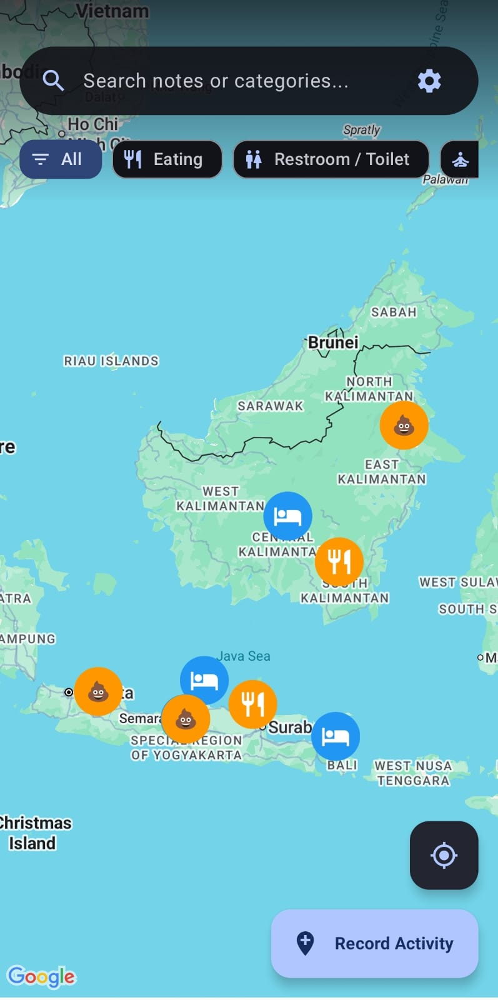

<p align="center">
  
</p>

<h1 align="center">LifeMarker</h1>

<p align="center">
  
  
  
  
</p>

<p align="center">
  <strong>Precise Activity Tracking & Geographic Journaling for Android</strong>
</p>

---

## Overview

LifeMarker is a refined Android application designed for professionals and enthusiasts who need to track their daily activities with geographic precision. Built with modern Android technologies, it provides a seamless experience for logging locations, categories, and personal notes on an interactive map interface.

## Key Features

- **Interactive Geographic Journaling**: Mark your activities directly on a high-performance Google Maps interface.
- **Customizable Category Management**: Organize your life with a flexible category system, including custom icons and color schemes.
- **Rich Media Support**: Attach photos and detailed notes to every marker for a comprehensive activity log.
- **Advanced Location Selection**: Pick your current location or long-press anywhere on the map to set a custom activity point.
- **Secure Cloud Synchronization**: Backup and restore your data using Google Drive integration with end-to-end security.
- **Multi-language Support**: Fully localized in English, Indonesian, Arabic, Spanish, French, Russian, and Chinese.
- **Privacy First**: Local-first architecture ensures your data remains on your device until you choose to sync.

## Technical Stack

- **UI**: Jetpack Compose
- **Language**: Kotlin
- **Dependency Injection**: Hilt
- **Database**: Room Persistence Library
- **Architecture**: MVVM (Model-View-ViewModel)
- **Map Integration**: Google Maps Compose
- **Asynchronous Processing**: Kotlin Coroutines & Flow
- **Image Loading**: Coil

## Visual Preview



## Getting Started

### Prerequisites

- Android Studio Flamingo | 2022.2.1 or newer
- JDK 17
- Google Maps API Key

### Installation

1. Clone the repository:
   ```bash
   git clone https://github.com/mlintangmz2765/LifeMarker.git
   ```
2. Open the project in Android Studio.
3. Add your Google Maps API Key to `local.properties`:
   ```properties
   MAPS_API_KEY=your_api_key_here
   ```
4. Build and run the application on your device or emulator.

## Security & Compliance

This project has undergone a thorough security audit to ensure best practices in data handling and synchronization. For more details, see [SECURITY.md](SECURITY.md).

## Contributing

We welcome contributions! Please see [CONTRIBUTING.md](CONTRIBUTING.md) for guidelines on how to get started.

## License

This project is licensed under the MIT License - see the [LICENSE](LICENSE) file for details.

---

<p align="center">
  Developed with ❤️ by <a href="https://github.com/mlintangmz">mlintangmz</a>
</p>
